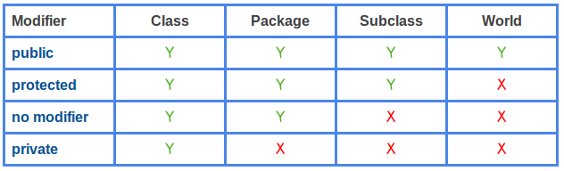

## 규칙13. 클래스와 멤버의 접근 권한은 최소화 하라

### 잘 설계된 모듈이란?
 - 내부 데이터 및 구현 세부사항을 다른 모듈에 잘 감추느냐의 여부
 - 세부사항을 API 뒤쪽에 감추며, 내부는 신경쓰지 않는다.
 - 정보 은닉 또는 캡슐화라는 개념으로 알려져 있음.

### 1. 정보 은닉
 - 정보 은닉은 모듈 사이의 의존성을 낮춰서, 개별적으로 개발, 시험, 변경할 수 있도록 한다.
 - 각각의 모듈을 병렬적으로 개발하여 개발 속도가 올라감.
 - 좋은 성능을 자동적으로 보장하지는 않지만, 효과적인 성능 튜닝을 가능하게 함
   + 시스템 완성 후 어떤 모듈이 문제를 일으키는지 프로파일링(유형 분석)을 하기 용이함.
 - 각각의 모듈을 성공적으로 구현할 수 있으므로, 대규모 시스템 개발 과정의 위험성을 낮춘다


### 2. 각 클래스와 멤버는 가능한 한 접근 불가능하도록 만들라.
 - 최상위 레벨 클래스나 인터페이스는 가능한 package-private로 선언해야 한다.
    + API일부가 아니라 구현 세부사항에 속하게 되므로(클라이언트는 모르므로) 자유로이 변경하거나 삭제할 수 있다.

### 3. 멤버 접근 권한
 - private : 이렇게 선언된 멤버는 선언된 최상위 레벨 클래스 내부에서만 접근 가능하다.
 - package-private : 같은 패키지 내의 아무 클래스나 사용할 수 있다. / 아무런 접근 수정자를 붙이지 않으면 이 권한이 주어짐
 - protected : 선언된 클래스 및 그 하위 클래스만 사용할 수 있다. 같은 패키지도 사용 가능
 - public : 어디서든 사용가능

 

 - public 클래스의 경우 접근 권한을 protected로 변경하면 ***공개 API*** 가 되며, 영원히 유지해야한다.
 - 상위 클래스 메서드를 재정의 할 때에는 원래 메서드의 접근 권한보다 낮은 권한을 설정할 수 없다.
   + 따라서 interface를 설계할 때에는 모든 메서드를 public으로 선언해야 한다.

### 4. 객체 필드는 절대로 public으로 선언하면 안 된다.
 - 메서드를 통하지 않고 필드의 값을 변경할 수 있게 된다.
 - ***다중 스레드에 안전하지 않다.***
 - 어떤 *상수* 들이 클래스로 추상화된 결과물의 핵심 부분을 구성하는 경우, public static final 필드로 공개할 수 있다.
   + 관습적으로 이름이 대문자이며, 밑줄 기호로 구분한다. ex) MIN_VALUE
   + 반드시 기본 자료형 값들을 갖거나, 변경 불가능 객체를 참조해야 한다.(수정자X, final클래스, final, private)

### 5. 길이가 0이 아닌 배열은 변경 가능하므로, public static final 배열 필드를 두거나, 배열 필드를 반환하는 접근자를 정의하면 안 된다.

```JAVA
//보안 문제를 초래할 수 있는 코드
public static final Thing[] VALUES = { ... };
```
 - 많은 IDE들이 private로 선언된 배열 필드에 대한 참조를 반환하는 접근자를 자동 생성하므로 주의.
   + VALUES 안에 접근이 가능하다?

```JAVA
private static final Thing[] PRIVATE_VALUES = { ... };
public static final List<Thing> VALUES =
  Collections.unmodifiableList(Arrays.asList(PRIVATE_VALUES));


private static final Thing[] PRIVATE_VALUES = { ... };
public static final Thing[] values() {
  return PRIVATE_VALUES.clone();
}
```

- 이렇게 변경이 불가능한 리스트를 만들거나, 해당 배열을 복사해서 반환하는 메서드를 추가하여 클라이언트에게 전달.

### 6. 요약
 - 접근 권한은 가능한 낮추라.
 - 최소한의 public API를 설계한 다음, 다른 모든 클래스, 인터페이스, 멤버는 API에서 제외하라.
 - ***public static final 필드를 제외한 어떤 필드도 public 필드로 선언하지 마라.***
 - public static final 필드가 참조하는 객체는 변경 불가능 객체로 만들라.
 
